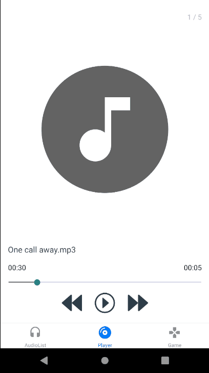

# end user documentation

---

## Index

- [Introduction](#Introduction)
- [Audio List](#Audio-List)
- [Player](#Player)
- [Game](#Game)
- [README](README.md)
- [REPO](https://github.com/shadykh/js-401n9-class-41)

---

# Introduction

This app is used to play music and play a game together, this app has three screens:

- Audio List
- Player
- Game

This app id done by React Native, and the purpose of this app; is to complete a task required from ASAC.

---

# Audio List

In this screen, you will see your audio files that you have in your local mobile, when you gave the app the permission to access your files, it will reads all the audio files and list them to you in this screen.

- 

---

# Player

In this screen, you will see your audio that you are playing, here you can:

- play/pause
- next
- previous
- forward / backward by bar

- 

---

# Game

In this screen, you will see the best game ever, Flappy ASAC game, you can here play or push the game, you should pass the obstacles without touching them, your score will increase by passing the obstacles, when you hit one of them, your score will be zero.

- 

---
